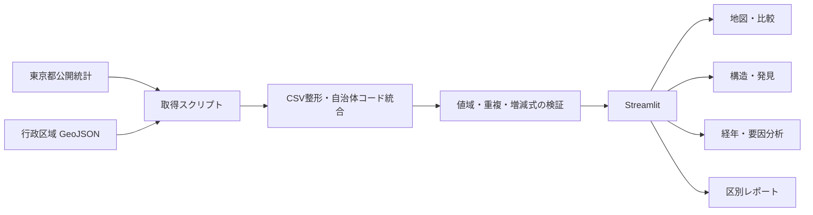

# Project Story

## 1. 目的

東京都の公開統計は信頼性が高い一方、人口、高齢化、行政区域、人口動態が別々の表として公開されています。本プロジェクトでは、東京23区の違いを一つの流れで確認できるように、地図・比較・構造・経年変化・人口増減要因を統合しました。

## 2. 問い

- 区ごとに人口、高齢化率、人口密度はどの程度違うか
- 2区を比べたとき、実数と23区中央値を基準にした指数では何が見えるか
- 人口密度と高齢化率の組み合わせに、どのような都市構造があるか
- 2015年以降、人口と高齢化率はどう変化したか
- 2025年の人口変化は、社会増減と自然増減のどちらから生じたか

## 3. 構成



## 4. 技術

- Python / pandas
- Streamlit
- Altair
- PyDeck
- GeoJSON
- GitHub Actions
- unittest

## 5. 設計上の判断

### 異なる単位をそのまま混ぜない

人口、高齢化率、人口密度は単位が異なります。2区比較では実数を示したうえで、23区中央値を100とする指数を併記しました。

### 探索指標と評価を区別する

中央値による都市タイプ、類似区、相関係数は、特徴を見つけるための補助指標です。良し悪しや政策効果を直接示さないことを画面内に記載しました。

### データの整合性をコードで確認する

23区数、自治体コード重複、欠損、値域を検証しています。人口動態では、自然増減＝出生数－死亡数、人口増減＝社会増減＋自然増減＋その他増減も確認します。

### 表示速度を落とさない

重い地図や経年計算を必要なタブだけで実行し、計算結果はキャッシュしています。

## 6. 試行錯誤

1. 最初は単年度の地図表示から開始した
2. 比較だけでは変化の背景を説明できないため、経年データを追加した
3. PyDeckで経年地図のポリゴンが崩れたため、AltairのGeoJSON描画へ置き換えた
4. 類似区計算でobject型が混ざったため、計算前の数値型変換を追加した
5. 公式CSVの取得と検証を手作業からスクリプトへ移した
6. 画面のコピーと配色を見直し、機能が先に伝わる構成へ修正した

## 7. 再現方法

```bash
python -m venv .venv
source .venv/bin/activate
pip install -r requirements.txt
python validate_project.py
python -m unittest discover -s tests -v
python -m streamlit run app.py
```

## 8. 限界

- 公開統計の更新時期は指標ごとに異なる
- 相関や分類は因果関係を示さない
- 23区単位の集計であり、町丁目レベルの差は扱っていない
- 人口変化の背景には住宅、地価、雇用、再開発など未収録の要因もある

## 9. 次の改善

- 年齢5歳階級別人口の追加
- 転入元・転出先の関係可視化
- 住宅・地価・事業所データとの統合
- 分析条件をURLで共有できる状態管理
