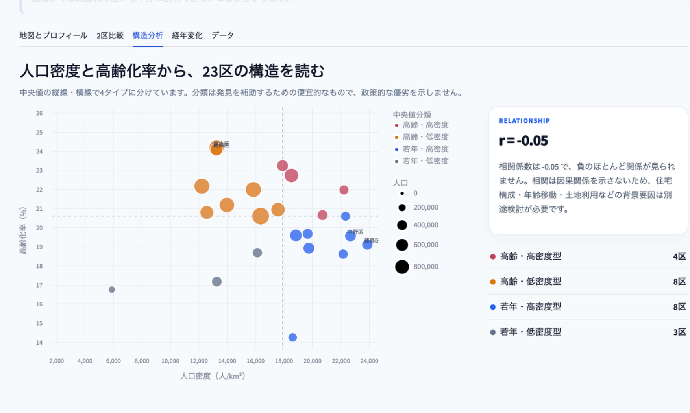

<!-- FINAL_SUBMISSION_PACKAGE_V1 -->
# 東京23区データダッシュボード

東京23区の人口、高齢化、人口密度、人口増減、年齢構成を、
地図・比較・推移から確認する公開データダッシュボードです。

**公開版：https://teeqy5f9waeoacgwccu4yc.streamlit.app**

## このプロジェクトで扱う問い

- 同じ「人口が多い区」でも、人口密度や年齢構成はどう違うか
- 長期的な人口増減と、直近の社会増減・自然増減は同じ方向か
- 似ている区はどこか、その近さはどの指標から生まれているか
- 特定の年代は東京23区のどこに集まっているか

## 主な機能

- 23区の地図・ランキング・プロフィール
- 2区比較と2〜4区の調査ボード
- 2015〜2026年の人口・高齢化率の推移
- 2025年の社会増減・自然増減・その他増減
- 2026年の5歳階級別人口と人口ピラミッド
- 年齢地図、類似度マップ、区レポート
- CSV・Markdown形式での結果保存

## 設計で重視したこと

- 指標の高低を良し悪しとして扱わない
- 元の数値と相対指標を同じ画面で確認できる
- 類似度や相関を因果関係として説明しない
- データの更新年と出典を明記する
- 自動テストと公開版確認を用意する

## 技術

Python / Streamlit / pandas / Altair / PyDeck / GitHub Actions

## ローカル実行

```bash
cd ~/Documents/regional-map-app
source .venv/bin/activate
python -m streamlit run app.py
```

## 品質確認

```bash
python -m unittest discover -s tests -v
python scripts/final_audit.py
```

詳しい提出説明は
[SUBMISSION_BRIEF.md](SUBMISSION_BRIEF.md)、
発表用の話し方は
[PORTFOLIO_TALK_TRACK.md](PORTFOLIO_TALK_TRACK.md)にまとめています。

---

# 東京23区 都市構造ダッシュボード

[](https://github.com/yugoo4321-collab/regional-map-app/actions/workflows/production-quality.yml)

[](https://teeqy5f9waeoacgwccu4yc.streamlit.app)

東京都の公開統計と行政境界データを組み合わせ、東京23区の人口・高齢化率・人口密度を、**地図で俯瞰し、2区比較で違いを捉え、散布図で都市構造を読み解き、経年変化で街の動きを追う**Streamlitダッシュボードです。

## 公開アプリ

https://teeqy5f9waeoacgwccu4yc.streamlit.app

<!-- SHOWCASE_START -->
## 画面イメージ

### 全体像

地図・指標切替・KPI・自動インサイトを一つの画面にまとめ、23区全体の傾向から個別区の特徴へ自然に移れる構成にしています。


### 構造分析

人口密度と高齢化率を散布図で捉え、中央値を基準に4タイプへ分類しています。相関係数と解釈上の注意も同じ画面で確認できます。


<!-- SHOWCASE_END -->

## ビジュアル・体験設計

- ダークネイビーのヒーローと抽象都市ネットワークで、作品の世界観を提示
- 「俯瞰・比較・構造・変化」の4段階を探索導線として可視化
- KPI、プロフィール、タブ、グラフ、表の余白と質感を統一
- モバイル表示と`prefers-reduced-motion`に対応

## この作品でできること

- 高齢化率・人口・人口密度を切り替えられるコロプレス地図
- 選択した区の順位、23区平均との差、都市タイプの確認
- 任意の2区について、絶対値と「23区中央値＝100」の指数で比較
- 人口密度 × 高齢化率の散布図による4タイプ分析
- **2015〜2026年の人口・高齢化率の推移分析**
- 開始年と終了年を選んだ人口増減率・高齢化率変化の地図
- 区別の推移グラフ、変化ランキング、期間プロフィール
- 指標別順位と中央値差を含む統計一覧のCSV保存
- 東京都の公式CSVを取得・検証・整形する再現可能な処理

### 特徴分析

現在値と2015〜2026年の変化を組み合わせ、人口増加、高齢化率変化、都市密度、23区平均との差を自動抽出します。選択区について自然文の都市ブリーフ、中央値との差、特徴が近い3区を表示します。類似度と総合距離は優劣ではなく、探索を補助する透明な指標として扱います。

### 人口変化の要因分析

2025年中の人口変化を、他県移動、都内間移動、出生・死亡、その他増減へ分解します。区別の要因分解、地図、社会増減×自然増減の散布図、ランキングを通じて、人口が「なぜ」変化したかを確認できます。


### 3分デモ

人口規模が近い区の違い、人口と高齢化の時間変化、社会増減と自然増減の分解を、4段階で説明する発表用画面です。各問いの対象区はデータから自動抽出します。


## Review links

- [3分デモ](https://teeqy5f9waeoacgwccu4yc.streamlit.app/?tab=demo)
- [プロジェクト概要](https://teeqy5f9waeoacgwccu4yc.streamlit.app/?tab=project)
- [要因分析の例](https://teeqy5f9waeoacgwccu4yc.streamlit.app/?tab=factors&ward=杉並区)
- [提出用リンク一覧](SUBMISSION_LINKS.md)


### 年齢構成

2026年1月1日の5歳階級別人口から、2区の人口ピラミッド、構成比の差、外国人割合、5歳階級別の年齢地図を表示します。


### 区レポート

現在値、長期変化、人口動態、年齢構成を1ページにまとめ、10指標の類似度を地図と指標別の差で表示します。


### 調査ボード

2〜4区を固定し、若い世代、人口の動き、高齢化、国際性などの切り口で比較します。

## Project documentation

- [Investigation Board](INVESTIGATION_BOARD.md) — 比較指標と出力


- [Ward Brief](WARD_BRIEF.md) — 指標と近さの計算


- [Age Structure](AGE_STRUCTURE.md) — データ定義と検証


- [Production Readiness](PRODUCTION_READINESS.md) — 品質ゲートと公開版確認


- [Data Catalog](DATA_CATALOG.md) — データセット、指標定義、検証式


- [Design System](DESIGN_SYSTEM.md) — スタイル、文言、アクセシビリティの方針


- [UI Copy Guide](UI_COPY_GUIDE.md) — 画面文言の基準と避ける表現


- [Project Story](PROJECT_STORY.md) — 課題設定、設計判断、試行錯誤、限界
- [Changelog](CHANGELOG.md) — 実装の改善履歴
- `tests/test_project_integrity.py` — データ整合性テスト
- `.github/workflows/portfolio-quality.yml` — 自動検証

## 分析の導線

1. **地図とプロフィール**：23区全体を俯瞰し、選択区の特徴を確認
2. **2区比較**：異なる単位を混ぜず、絶対値と中央値指数で比較
3. **構造分析**：人口密度と高齢化率の関係を散布図で確認
4. **経年変化**：人口と高齢化率がいつ・どの区で変化したかを追跡
5. **データ**：派生指標を含む表を確認し、CSVとして保存

## 設計上の工夫

### 1. 現在地と変化の両方を見る

2026年時点の都市構造だけでなく、住民基本台帳の時系列データを使って2015年以降の変化を可視化しました。「どこが高いか」に加え、「どこが変わったか」を調べられます。

### 2. 異なる単位を不透明に合算しない

人口・高齢化率・人口密度を一つの独自総合スコアにまとめず、公表値をそのまま表示しています。2区比較では、各指標の23区中央値を100とした透明な指数を補助的に使用しています。

### 3. 色に価値判断を持たせない

経年変化地図の青とオレンジは、減少・増加の方向と大きさを示すだけです。増加を「良い」、減少を「悪い」と評価するものではないことを画面上に明記しています。

### 4. 解釈の限界を明示する

相関が因果関係を示さないこと、人口や高齢化率の変化要因を特定するには、住宅供給、出生死亡、人口移動、土地利用などの追加データが必要であることを表示しています。

### 5. 再現可能なデータ処理

- `prepare_data.py`：2026年の現況データを検証・整形
- `prepare_history.py`：東京都公式の時系列CSVを取得し、2015〜2026年の23区データを生成

画面表示用の数値を手作業で書き換えない構成です。

## 品質管理

- `validate_project.py`で、23区の件数、欠損、重複、値域、人口密度の再計算、GeoJSONとの自治体コード整合、経年データの年次網羅性を検証
- GitHub Actionsでpush・pull requestごとにデータ検証とPython構文チェックを自動実行
- データタブ上でも件数・対象年・欠損・重複を確認可能
- 画面幅640px以下を想定したモバイル向けレイアウト調整

## 使用データ

### 現況分析

- 東京都「区市町村統計表（2026年）」
- 人口密度：人口 ÷ 面積（km²）で算出

### 経年変化

- 東京都「住民基本台帳による東京都の世帯と人口」時系列データ
- 区市町村別男女別人口（昭和60年〜令和8年）
- 区市町村年齢3区分別構成比（昭和60年〜令和8年）
- 各年1月1日現在

### 地理データ

- 国土交通省「国土数値情報（行政区域データ）」をもとにNIIが加工した2023年1月1日時点のGeoJSON

現況統計と経年統計は統計体系が異なるため、絶対値が一致しない場合があります。行政境界は地理的な比較にのみ使用しています。

## 使用技術

- Python
- Streamlit
- pandas
- Altair
- PyDeck
- Git / GitHub
- Streamlit Community Cloud

## 起動方法

```bash
python -m pip install -r requirements.txt
python prepare_data.py
python prepare_history.py
python -m streamlit run app.py
```

## ファイル構成

```text
regional-map-app/
├── app.py                       # ダッシュボード本体
├── prepare_data.py              # 現況データの検証・整形
├── prepare_history.py           # 経年CSVの取得・整形
├── requirements.txt
├── validate_project.py          # データ・地理情報の品質検証
├── .github/
│   └── workflows/
│       └── validate.yml         # 自動品質チェック
├── assets/
│   ├── dashboard-overview.png
│   └── structure-analysis.png
├── .streamlit/
│   └── config.toml
└── data/
    ├── raw/
    │   ├── tokyo_population_timeseries_1985_2026.csv
    │   └── tokyo_aging_share_timeseries_1985_2026.csv
    ├── tokyo_wards.csv
    ├── tokyo_wards_history.csv
    └── tokyo_wards.geojson
```

## 今後の拡張

- 人口増減の要因を出生死亡・転入転出に分解
- 医療、買い物、交通など生活アクセス指標の追加
- 世帯構成や住宅供給を含む多変量分析
- 選択区の特徴と変化をまとめたレポート出力

## 運用

- 公開版はStreamlit Community Cloudで稼働
- Mac内の確認用サーバーはlaunchdで常駐
- 詳細は[RUNBOOK.md](RUNBOOK.md)を参照

- [3分デモ用メモ](DEMO_SCRIPT.md) — 発表時の説明順と補足

## Quality gate

```bash
source .venv/bin/activate
python scripts/quality_gate.py
```

## 画面構成

<!-- COMPACT_NAVIGATION_V1 -->
- 基本：地図、区レポート、デモ
- 比較：2区比較、調査、構造、年齢
- 発見：特徴、要因、推移
- 補足：プロジェクト、データ
